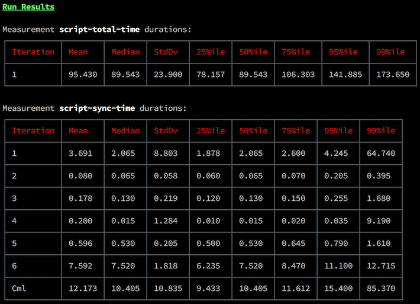

# Timingz.js



Timingz.js is a tool for collecting measurements of code execution times in the
browser and deriving statistical data from those measurements. It makes it easy
to run your code under test many times and collect data to produce meaningful
data-points like mean, median, and standard deviation.

Timingz.js comes in two parts: a client side module that wraps the browser's
`window.performance` API and a command line tool for running the data collection
server and displaying results. The client module captures the start and end
times for each measurement and sends them back to the server, which keeps track
of the data and calculates the data points at the end.

## Terminology

### Measurement

A measurement is a named data entry with start and end points specified in the
code under test.

### Iteration

An iteration is a specific instance of a measurement starting and ending. If you
set a measurement in a function and that function is called three times, there
will be three iterations for that measurement.

### Run

A run is one full execution of the code under test. The data Timingz.js provides
is based on the durations of every iteration for every measurement across all
runs.

## Usage

### Client-Side

To set up measurements for your codebase, you instantiate the Timingz.js client,
place calls to its `startMeasurement()` and `endMeasurement()` methods in your
code, and call its `endRun()` method when your code has finished executing.

```javascript
import TimingzClient from 'timingz/client';

let timingz = new TimingzClient();

function myBusyFunction() {
  timingz.startMeasurement('busy-function');
  // Your code to measure...
  timingz.endMeasurement('busy-function');
}

myBusyFunction();
timingz.endRun();
```

#### Customize Next Run Logic

You change how a new run of your code is started by passing a function as the
`onNewRun` option to the Timingz.js client. This way, you can do something other
than (or in addition to) refreshing the page.

```javascript
let timingz = new TimingzClient({
  // A reloadPage function is passed so you can trigger a page refresh if you
  // want.
  onNewRun(reloadPage) {
    // Your code restart logic...
  }
});
```

#### Specifying Server Host

Timingz.js can serve static files for you (see Serving Static Files below). But
if you're serving the code to test from a different server, you'll have to
specify the host for the Timingz.js server for the `TimingzClient`:

```javascript
let timingz = new TimingzClient({
  serverHost: 'http://localhost:8000'
});
```

### CLI

After you've set up Timingz.js in your code, you can run its CLI to start a
server to listen for measurement data from the client. Once running, use your
browser to visit the page containing the code you're testing. The Timingz.js
client will collect data as your code runs and send it to the CLI server. The
server will instruct the client to rerun your code (with a page refresh by
default) until it has run a specific number of times (defaults to 50). After all
the runs are complete, the CLI will display the statistical results.

```bash
timingz run
```

#### Specifying Number of Runs

Specify the number of runs with `--runs` or `-r`:

```bash
timingz run --runs=100
```

#### Serving Static Files

You can specify a comma-separated list of directories to serve using the
`--serve` or `-s` option. So if the code you're testing consists only of static
files, you can let Timingz.js serve it for you.

```bash
timingz run --serve=dist
```

#### Saving Results to a File

You can specify a file to save the results to for later viewing with the `--out`
or `-o` options. Results are saved in JSON format.

```bash
timingz run --out=results.json
```

#### Viewing Saved Results

You can view the results from a previous set of runs using the `view` command:

```bash
timingz view results.json
```

#### Getting Help

To see more options available for each command, run:

```bash
timingz <command> --help
```

## Alternatives

Timingz.js focuses on helping you determine the performance of code through
statistical measurements. If you're looking for a more general library for
measuring code execution times in the browser, check out these alternatives:

* [marky](https://github.com/nolanlawson/marky)
* [Surf-N-Perf](https://github.com/Comcast/Surf-N-Perf)

## License

Copyright 2017 LinkedIn Corp. Licensed under the BSD 2-Clause License (the
"License").
See License in the project root for license information.
